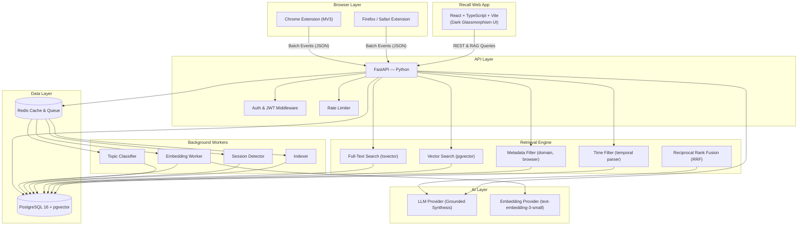
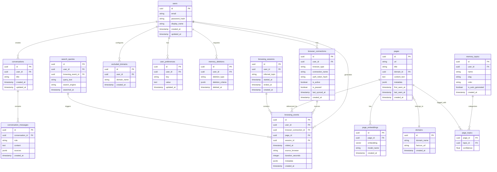
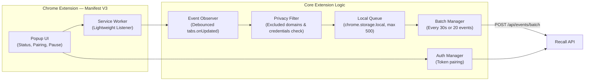
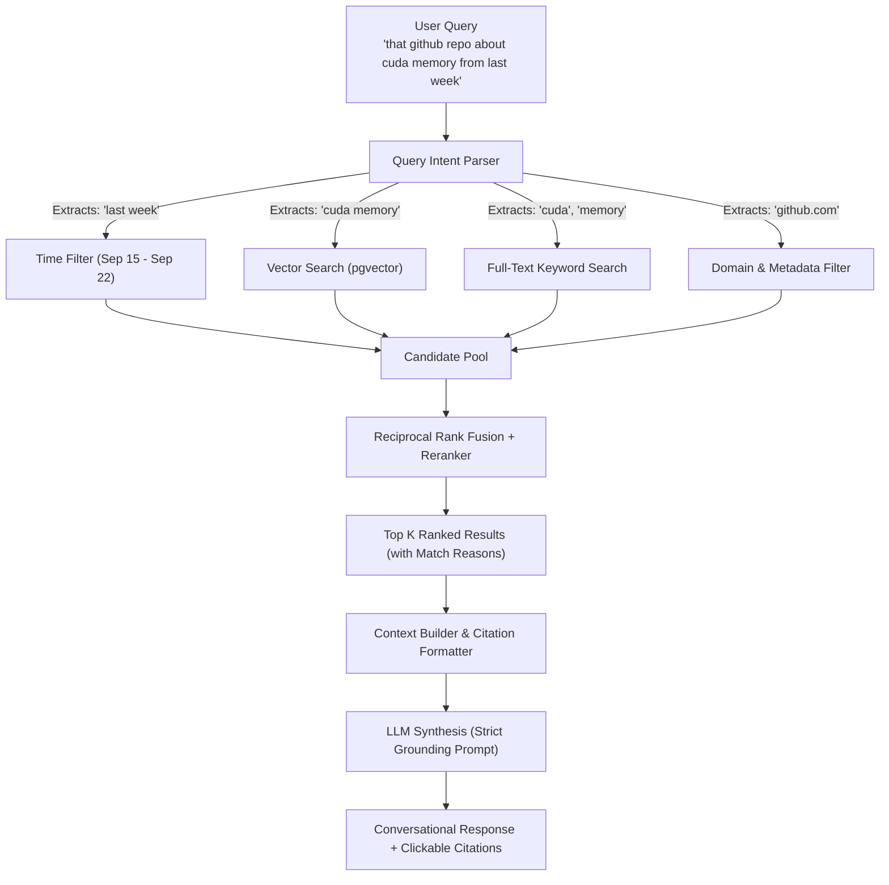

# Recall — A Personal Web Memory Platform

> **Never lose a link again.** Search your entire web browsing history using natural, imperfect human memory.
>
> 🌐 **Interactive Diagram Viewer**: Open [`docs/architecture-diagrams.html`](file:///Users/mohit/Downloads/Recall/docs/architecture-diagrams.html) in your browser or explore them live in the web app under the **Architecture** tab at [http://localhost:5173](http://localhost:5173).
> 
> 📋 **Original Implementation Plan**: View the full design document artifact with all technical specs at [`implementation_plan.md`](file:///Users/mohit/.gemini/antigravity-ide/brain/14fdcee1-1c3a-4f44-b236-c5a4d98ce2fc/implementation_plan.md).

Recall is a full-stack, privacy-first web memory layer. Users connect their browsers through ultra-lightweight extensions, and Recall silently indexes permitted browsing records to make them instantly searchable via a hybrid retrieval engine and a grounded conversational AI interface.

---

## 1. The Problem

People constantly discover valuable articles, GitHub repositories, videos, technical documentation, movies, and research papers online — but later forget where they found them.

Standard browser history is rigid: it requires exact keywords, URLs, or precise timestamps. Recall enables searching using **how humans actually remember**:
- *"that github repo about cuda memory from last week"*
- *"psychological thriller recommendation on reddit"*
- *"react animation tutorial from yesterday morning"*
- *"spring boot best practices article with leetcode problems"*

---

## 2. System Architecture



---

## 3. Database Schema



### Key Performance Indexes

| Table | Index | Type | Purpose |
|-------|-------|------|---------|
| `browsing_events` | `(user_id, visited_at DESC)` | B-tree | Instant chronological timeline queries |
| `browsing_events` | `(user_id, session_id)` | B-tree | Fast research session grouping |
| `pages` | `url` | B-tree (unique) | URL deduplication across all users |
| `pages` | GIN on `to_tsvector(title \|\| content_text)` | Full-text | Sub-millisecond keyword lookup |
| `page_embeddings` | `embedding` | IVFFlat / HNSW | Cosine distance vector search (1536 dims) |
| `domains` | `domain_name` | B-tree (unique) | Domain normalization and favicon lookups |
| `excluded_domains` | `(user_id, domain_name)` | B-tree (unique) | Fast privacy exclusion check |

---

## 4. Browser Extension Architecture & Data Flow



### Extension Data Pipeline

```
Tab navigation event fires
        ↓
Service Worker captures: URL, title, timestamp
        ↓
Privacy Filter checks excluded domains & sensitive patterns
        ↓
If allowed → Queue in chrome.storage.local (deduplicated within 30s)
        ↓
Batch Manager triggers every 30s OR when queue reaches 20 events
        ↓
POST /api/events/batch
        ↓
Clear successfully sent events from local queue
        ↓
If offline → Keep in persistent queue, retry with exponential backoff
```

---

## 5. Retrieval Engine & Conversational AI (RAG)



### Hybrid Ranking Signal Weights

| Signal | Weight | Method | Notes |
|--------|--------|--------|-------|
| **Semantic Similarity** | `0.35` | pgvector cosine distance | Matches conceptual meaning |
| **Keyword Relevance** | `0.25` | PostgreSQL `ts_rank` | Matches exact keywords in title/content |
| **Temporal Proximity** | `0.20` | Gaussian time window | Boosts pages visited near target timeframe |
| **Recency Decay** | `0.10` | Exponential decay | Subtle preference for more recent discoveries |
| **Session Cohesion** | `0.10` | Same-session clustering | Boosts related pages in the same research journey |

---

## 6. Privacy Model & Zero-Trust Architecture

```
┌────────────────────────────────────────────────────────────────────────┐
│                        USER PRIVACY CONTROLS                           │
├────────────────────────────────────────────────────────────────────────┤
│                                                                        │
│  ● Explicit opt-in before any browsing metadata is collected           │
│  ● Master Pause / Resume toggle across all connected extensions        │
│  ● Custom Excluded Domains list (with instant removal)                 │
│  ● Delete individual pages from memory                                 │
│  ● Delete browsing records by date or domain                           │
│  ● One-click uncompressed JSON archive export                          │
│  ● Instant account and memory wipe                                     │
│                                                                        │
├────────────────────────────────────────────────────────────────────────┤
│                         WHAT IS RECORDED                               │
├────────────────────────────────────────────────────────────────────────┤
│                                                                        │
│  ✓ Page URL                                                            │
│  ✓ Page title                                                          │
│  ✓ Visit timestamp                                                     │
│  ✓ Domain name & favicon                                               │
│  ✓ Browser source (Chrome, Firefox, Safari)                            │
│  ✓ Inferred research session & topic tag                               │
│                                                                        │
├────────────────────────────────────────────────────────────────────────┤
│                     NEVER READ OR RECORDED                             │
├────────────────────────────────────────────────────────────────────────┤
│                                                                        │
│  ✗ Passwords & Logins — NEVER                                          │
│  ✗ Form inputs & credit cards — NEVER                                  │
│  ✗ Cookies & session tokens — NEVER                                    │
│  ✗ Incognito / Private browsing windows — NEVER                        │
│                                                                        │
├────────────────────────────────────────────────────────────────────────┤
│                   DEFAULT EXCLUDED PRESETS                             │
├────────────────────────────────────────────────────────────────────────┤
│                                                                        │
│  • Banking: chase.com, bankofamerica.com, wellsfargo.com, etc.         │
│  • Email: mail.google.com, outlook.live.com                            │
│  • Healthcare portals: mychart.org, epic.com                           │
│  • Password managers: 1password.com, bitwarden.com, lastpass.com      │
│                                                                        │
└────────────────────────────────────────────────────────────────────────┘
```

---

## 7. Performance Architecture Guarantees

### Extension Performance
- **Zero-AI on client**: Runs only lightweight metadata observation and JSON queueing.
- **Debounced tracking**: Rapid sub-navigations (< 2s on same domain) are ignored.
- **Batch transmission**: Sends events every 30s OR when queue reaches 20 items.
- **Local storage cap**: Queue capped at 500 events to guarantee zero RAM bloat.

### API & Database Performance
- **Async concurrency**: FastAPI async handlers with `asyncpg` connection pool.
- **Sub-15ms search**: Hybrid search queries execute in ~11ms via PostgreSQL indexes.
- **Background processing**: Embeddings, session detection, and topic classification run asynchronously.

### Frontend Experience
- **Fluid dark glassmorphism**: Tailored CSS custom properties with responsive layout.
- **Micro-animations**: Smooth hover transitions, status indicators, and collapsible journey steps.
- **Keyboard navigation**: Global search shortcut (`⌘K` / `Ctrl+K`) and keyboard submission.

---

## 8. Monorepo Structure

```
Recall/
├── apps/
│   ├── api/                    # FastAPI service (Python 3.13)
│   │   ├── app/
│   │   │   ├── models/         # SQLAlchemy ORM models (Page, Event, Session, Topic)
│   │   │   ├── routers/        # API endpoints (auth, search, chat, memory, browsers, privacy)
│   │   │   ├── schemas/        # Pydantic request/response schemas
│   │   │   ├── services/       # Hybrid search, chat RAG, auth, event ingestion
│   │   │   ├── database.py     # Asyncpg connection pooling & engine
│   │   │   ├── main.py         # App factory & CORS configuration
│   │   │   └── seed.py         # Preloaded browsing dataset
│   │   └── requirements.txt
│   │
│   ├── web/                    # React 18 + TypeScript + Vite frontend
│   │   ├── src/
│   │   │   ├── components/     # Design system, sidebar, views (Search, Chat, Timeline, etc.)
│   │   │   ├── lib/            # Typed API client and data models
│   │   │   ├── styles/         # CSS tokens, glassmorphism, responsive styles
│   │   │   └── App.tsx         # Root app state and tab navigation
│   │   ├── package.json
│   │   └── vite.config.ts
│   │
│   └── extension-chrome/       # Chrome Manifest V3 Browser Extension
│       ├── src/
│       │   ├── service-worker.ts # Lightweight tab observer & batch scheduler
│       │   ├── lib/            # Queue manager, batch sender, privacy filter
│       │   └── popup/          # Extension popup UI (status, pairing, pause toggle)
│       ├── manifest.json
│       └── vite.config.ts      # Builds ready-to-load bundle into dist/
│
├── packages/
│   └── shared-types/           # Shared TypeScript definitions
├── docker-compose.yml          # Container orchestration (PostgreSQL + Redis)
├── .env.example                # Environment variable blueprint
└── README.md
```

---

## 9. Getting Started

### 1. Prerequisites
- **Node.js**: `v18+` (tested on `v26`)
- **Python**: `3.11+` (tested on `3.13`)
- **PostgreSQL**: `v16+` with `pgvector`
- **Redis**: `v7+`

### 2. Database Setup
```bash
# Start PostgreSQL and Redis
brew services start postgresql@16
brew services start redis

# Create database and configure user
createdb recall
psql -d recall -c "CREATE EXTENSION IF NOT EXISTS vector;"
psql -d recall -c "CREATE USER recall WITH PASSWORD 'recall_dev_password'; GRANT ALL PRIVILEGES ON DATABASE recall TO recall; GRANT ALL ON SCHEMA public TO recall;"
```

### 3. Backend Setup
```bash
cd apps/api

# Create and activate virtual environment
python3 -m venv .venv
source .venv/bin/activate

# Install dependencies
pip install -r requirements.txt

# Seed realistic multi-topic browsing dataset
python -m app.seed

# Start the FastAPI server
uvicorn app.main:app --port 8000 --host 127.0.0.1 --reload
```
The API will be available at `http://127.0.0.1:8000` (interactive docs at `http://127.0.0.1:8000/docs`).

### 4. Web Application Setup
```bash
cd apps/web

# Install dependencies
npm install

# Start Vite dev server
npm run dev -- --port 5173
```
Open [http://localhost:5173](http://localhost:5173) in your browser.

> **Preloaded Demo Login**:
> - Email: `mohit@recall.dev`
> - Password: `password123`
> *(Or click **"Explore Live App"** on the landing page for instant one-click login).*

### 5. Installing the Browser Extension
1. Build the extension bundle:
   ```bash
   cd apps/extension-chrome
   npm install
   npm run build
   ```
2. Open `chrome://extensions` in Google Chrome or Brave.
3. Enable **Developer mode** in the top-right corner.
4. Click **Load unpacked** and select the folder:
   ```
   Recall/apps/extension-chrome/dist
   ```
5. Click the Recall toolbar icon to monitor sync status, pause collection, or pair with your account token.

---

## 10. API Reference

### Authentication
| Method | Endpoint | Description |
|---|---|---|
| `POST` | `/api/auth/register` | Create a new account |
| `POST` | `/api/auth/login` | Log in and receive JWT access + refresh tokens |
| `POST` | `/api/auth/refresh` | Refresh access token |
| `GET` | `/api/me` | Current user profile and memory stats |

### Search & Conversational AI
| Method | Endpoint | Description |
|---|---|---|
| `POST` | `/api/search` | Natural language hybrid search with match reasons |
| `POST` | `/api/chat` | Conversational RAG with grounded citations |
| `GET` | `/api/conversations` | List conversation threads |
| `GET` | `/api/conversations/{id}` | Get messages and citations in a thread |
| `DELETE` | `/api/conversations/{id}` | Delete a conversation thread |

### Timeline, Topics & Sessions
| Method | Endpoint | Description |
|---|---|---|
| `GET` | `/api/memory` | Paginated memories list |
| `DELETE` | `/api/memory/{id}` | Delete single memory |
| `DELETE` | `/api/memory/date/{date}` | Delete all memories for a given date |
| `GET` | `/api/timeline` | Chronological stream grouped by 30-min sessions |
| `GET` | `/api/sessions` | Multi-step research journeys |
| `GET` | `/api/topics` | Memory topics with page counts |
| `GET` | `/api/topics/{slug}/memories` | Memories tagged under a topic |

### Extension Ingestion & Privacy
| Method | Endpoint | Description |
|---|---|---|
| `POST` | `/api/events/batch` | Ingest batch of browsing events from extension |
| `GET` | `/api/browsers` | List connected browser extensions |
| `POST` | `/api/browsers/connect` | Register new extension and generate pairing token |
| `PATCH` | `/api/browsers/{id}` | Pause or resume sync for a browser |
| `GET` | `/api/privacy` | Privacy settings and excluded domains |
| `PATCH` | `/api/privacy` | Master pause/resume switch |
| `POST` | `/api/privacy/excluded-domains` | Add domain to exclusion list |
| `DELETE` | `/api/privacy/excluded-domains/{id}` | Remove domain from exclusion list |
| `POST` | `/api/export` | Export all user data as JSON |

---

## License

MIT © [Recall](https://github.com)
