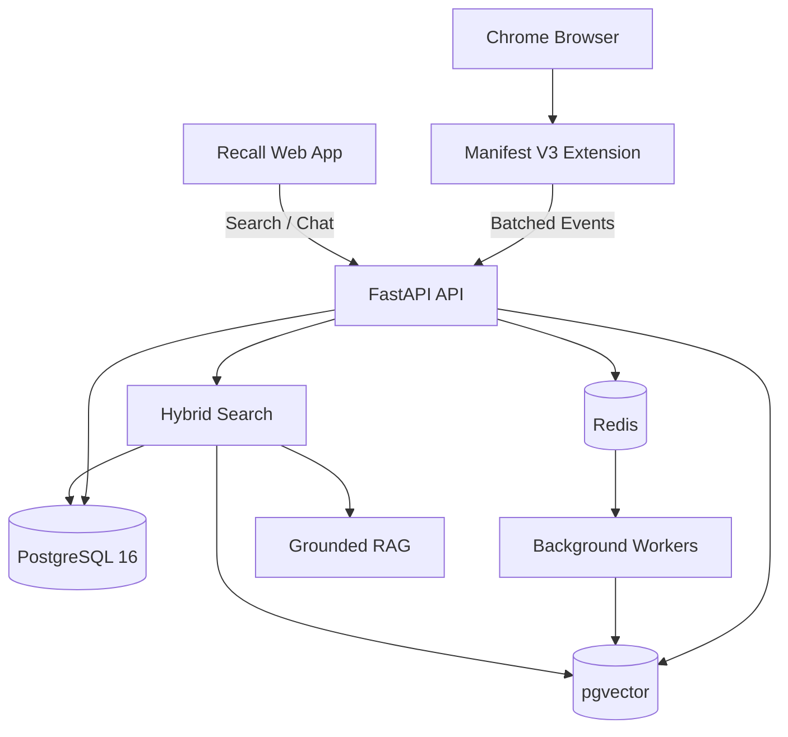

# Recall

### Your browser remembers everything. You don't.

**Recall is a privacy-first personal memory layer for the web.**

It lets you search your browsing history using the way you actually remember things — **not exact URLs, not perfect keywords, not browser-history archaeology.**

> *“What was that GitHub repo about CUDA memory I saw last week?”*

> *“There was a psychological thriller someone recommended on Reddit…”*

> *“Find that React animation tutorial I watched yesterday.”*

**Recall finds the memory.**

---

<p align="center">

**🧠 Remember the idea. Recall the source.**

</p>

---

## Why Recall?

The internet is full of things we discover and immediately forget.

An article.

A GitHub repository.

A YouTube video.

A Stack Overflow answer.

A research paper.

A product.

A Reddit thread.

You remember **what it was about**.

You might remember **roughly when you saw it**.

You might remember **where you saw it**.

But you probably don't remember the URL.

Traditional browser history expects you to search like a machine.

Recall lets you search like a human.

### Instead of:

```text
github.com/...
```

or

```text
cuda memory
```

### You can ask:

```text
that github repo about cuda memory from last week
```

Recall combines **semantic meaning + keywords + time + domain + browsing context** to reconstruct what you were looking for.

---

# ✨ What Recall Does

### 🔎 Search by memory

Search your browsing history using natural language.

```text
"that Spring Boot article I read a few days ago"
```

```text
"React animation tutorial from yesterday morning"
```

```text
"the Reddit discussion about psychological thrillers"
```

Recall understands the intent behind the query instead of requiring an exact match.

---

### 🧠 AI Memory Chat

Don't just search.

**Ask Recall.**

```text
What was the GitHub repository I looked at
when I was researching CUDA memory?
```

Recall retrieves relevant memories and generates a grounded answer with clickable sources.

Every answer is tied back to the memories it used.

No evidence → no invented answer.

---

### 🕒 Timeline

See what you explored over time.

Your browsing history becomes a chronological memory stream instead of an endless list of URLs.

---

### 🧭 Research Journeys

Recall can group related browsing activity into research sessions.

For example:

```text
Google
   ↓
NVIDIA CUDA Documentation
   ↓
Stack Overflow
   ↓
GitHub Repository
   ↓
YouTube Tutorial
```

Instead of remembering five disconnected pages, you can remember the **journey**.

---

### 🏷️ Memory Topics

Your browsing activity can be organized into meaningful topics.

```text
AI / ML
Backend
Java
CUDA
Research
Projects
Entertainment
```

So your history becomes something you can actually navigate.

---

### 🔐 Privacy Controls

Your browsing history is extremely personal.

Recall is designed around that reality.

You control what gets remembered.

* Explicit collection control
* Master pause/resume
* Excluded domains
* Individual memory deletion
* Delete memories by date
* Delete memories by domain
* Full JSON export
* Account/memory wipe
* User-isolated data access

The browser extension is intentionally lightweight and does **not** use AI on the client.

---

# 🛡️ What Recall Records

Recall currently focuses on browsing metadata required for memory retrieval:

```text
✓ Page URL
✓ Page title
✓ Visit timestamp
✓ Domain
✓ Browser source
✓ Research session
✓ Topic information
```

### Recall does NOT intentionally collect:

```text
✗ Passwords
✗ Form values
✗ Credit card information
✗ Cookies
✗ Authentication/session tokens
✗ Incognito/private browsing activity
```

You can also configure domains that Recall should never remember.

> **Your browser history belongs to you.**
>
> Recall should make it more useful — not less private.

---

# ⚡ Built to Stay Out of Your Way

Recall isn't supposed to become another application constantly consuming your resources.

The Chrome extension is deliberately lightweight.

### Extension

* Manifest V3
* Event-based observation
* No DOM scraping
* No client-side AI
* Local resilient queue
* Event deduplication
* Batched synchronization
* Exponential retry
* Bounded local storage
* Pause/resume control

The extension primarily observes navigation metadata, filters it, queues it locally, and synchronizes batches with the Recall API.

### Current queue design

```text
Browser Event
      ↓
Privacy Filter
      ↓
Local Queue
      ↓
Batch Manager
      ↓
Recall API
```

If the network disappears, the queue can retain events and retry later.

---

# 🚀 Hybrid Retrieval

Recall doesn't depend on a single search technique.

It combines multiple signals to find the memory you're actually looking for.

```text
                User Query
                    │
                    ▼
             Intent Parsing
                    │
        ┌───────────┼───────────┐
        ▼           ▼           ▼
     Keywords      Time       Domain
        │           │           │
        └───────────┼───────────┘
                    ▼
             Semantic Search
                    │
                    ▼
             Candidate Pool
                    │
                    ▼
        Ranking / Relevance Fusion
                    │
                    ▼
             Best Memories
```

| Signal              | Purpose                                                  |
| ------------------- | -------------------------------------------------------- |
| Semantic similarity | Understand conceptual meaning                            |
| Keyword relevance   | Match explicit terms                                     |
| Temporal proximity  | Understand phrases like “last week”                      |
| Recency             | Prefer relevant recent discoveries                       |
| Session cohesion    | Connect pages from the same research journey             |
| Domain metadata     | Understand sources such as GitHub, Reddit, YouTube, etc. |

This allows queries such as:

```text
"that github repo about cuda memory from last week"
```

to be decomposed into useful retrieval signals rather than treated as one giant keyword string.

---

# 🤖 Grounded AI

Recall's conversational layer uses retrieved browsing memories as its evidence.

```text
User Question
      ↓
Query Understanding
      ↓
Hybrid Retrieval
      ↓
Relevant Memories
      ↓
Context Builder
      ↓
LLM
      ↓
Answer + Sources
```

The goal is simple:

> **The AI should remember what you actually visited, not make up what you might have visited.**

Responses include source information such as:

* Page title
* Domain
* Visit date
* URL

If there isn't enough evidence, Recall should say so.

---

# 🏗️ Architecture



### Core stack

**Frontend**

* React
* TypeScript
* Vite
* Custom responsive UI

**Backend**

* Python
* FastAPI
* Async SQLAlchemy
* JWT authentication

**Data**

* PostgreSQL 16
* pgvector
* Redis

**Browser**

* Chrome Manifest V3
* Lightweight service worker
* Local persistent queue

**AI**

* Embeddings
* Vector retrieval
* Grounded conversational RAG

---

# 📦 Repository Structure

```text
Recall/
│
├── apps/
│   ├── api/
│   ├── web/
│   └── extension-chrome/
│
├── packages/
│   └── shared-types/
│
├── docker-compose.yml
├── .env.example
└── README.md
```

---

# 🔬 Performance

Recall is designed around asynchronous processing and bounded workloads.

### Browser extension

```text
Zero-AI client
      ↓
Event observation
      ↓
Deduplication
      ↓
Local queue
      ↓
Batch upload
```

### Backend

* Async FastAPI handlers
* PostgreSQL connection pooling
* Redis-backed background processing
* Indexed retrieval
* Batch event ingestion
* Asynchronous embeddings
* Paginated memory queries

### Current search benchmark

On the development dataset, the hybrid search path has been measured at approximately:

> **~11 ms**

for a tested CUDA-memory query.

This is a development measurement, not a universal production latency guarantee.

---

# 🧪 Verification

The current implementation has been tested across the primary Recall flow.

### API

* Search endpoint verified
* Conversational RAG verified
* Grounded citations verified

### Frontend

* Production TypeScript build
* Browser interaction testing
* Landing page
* Demo login
* Natural-language memory search
* AI memory chat

### Extension

* Manifest V3 build
* Local queue
* Synchronization
* Privacy filtering
* Pairing flow
* Pause control

---

# 🛠️ Run Recall Locally

## Requirements

* Node.js 18+
* Python 3.11+
* PostgreSQL 16+
* pgvector
* Redis 7+

## 1. Start PostgreSQL and Redis

```bash
brew services start postgresql@16
brew services start redis
```

Create the database:

```bash
createdb recall
```

Enable pgvector:

```bash
psql -d recall -c "CREATE EXTENSION IF NOT EXISTS vector;"
```

## 2. Start the API

```bash
cd apps/api

python3 -m venv .venv
source .venv/bin/activate

pip install -r requirements.txt

python -m app.seed

uvicorn app.main:app --port 8000 --host 127.0.0.1 --reload
```

API:

```text
http://127.0.0.1:8000
```

API documentation:

```text
http://127.0.0.1:8000/docs
```

## 3. Start the Web App

```bash
cd apps/web

npm install
npm run dev -- --port 5173
```

Then open:

```text
http://localhost:5173
```

---

# 🌐 Install the Chrome Extension

Build it:

```bash
cd apps/extension-chrome

npm install
npm run build
```

Then:

1. Open `chrome://extensions`
2. Enable **Developer mode**
3. Select **Load unpacked**
4. Choose:

```text
Recall/apps/extension-chrome/dist
```

5. Open the Recall extension
6. Pair it with your Recall account
7. Start remembering the web

---

# 🧩 API

### Authentication

```text
POST /api/auth/register
POST /api/auth/login
POST /api/auth/refresh
GET  /api/me
```

### Memory Search

```text
POST /api/search
POST /api/chat
```

### Conversations

```text
GET    /api/conversations
GET    /api/conversations/{id}
DELETE /api/conversations/{id}
```

### Timeline & Research

```text
GET /api/memory
GET /api/timeline
GET /api/sessions
GET /api/topics
```

### Privacy

```text
GET    /api/privacy
PATCH  /api/privacy
POST   /api/privacy/excluded-domains
DELETE /api/privacy/excluded-domains/{id}
POST   /api/export
```

### Browser Integration

```text
GET   /api/browsers
POST  /api/browsers/connect
PATCH /api/browsers/{id}
POST  /api/events/batch
```

---

# 🤝 Contributing

Recall is an open-source project.

If the idea resonates with you, there are many ways to help:

* ⭐ Star the repository
* 🐛 Report bugs
* 💡 Suggest features
* 🔧 Submit pull requests
* 🧪 Improve retrieval evaluation
* 🔐 Audit privacy/security
* ⚡ Improve performance
* 📚 Improve documentation

If you're interested in **AI, RAG, browser extensions, search engines, privacy, or developer tools**, this project is especially open to contributions in those areas.

---

# ⭐ If Recall Sounds Useful

If you've ever thought:

> *“I know I saw this somewhere… I just can't remember where.”*

then Recall was built for you.

**Star the repository if you'd like to follow the project.**

---

<p align="center">

### Recall

**Never lose a link again.**

*Remember the web. Find it again.*

</p>
